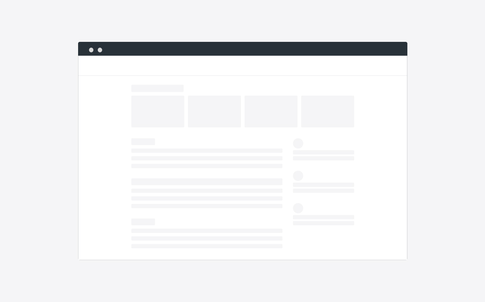
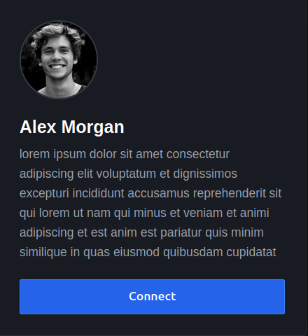
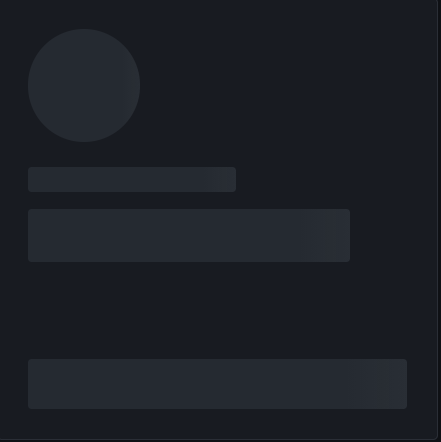
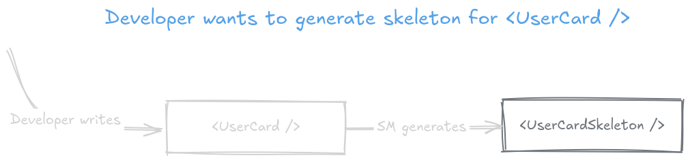
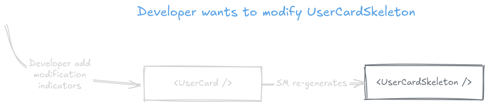
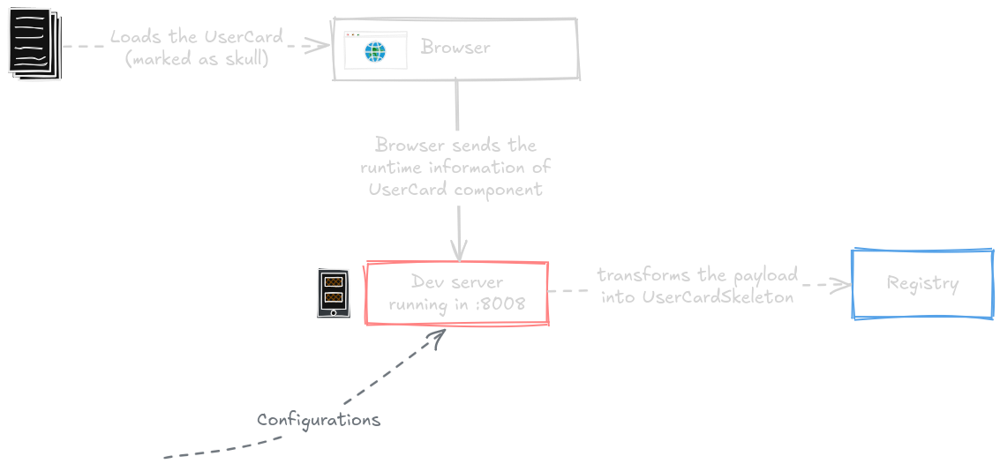
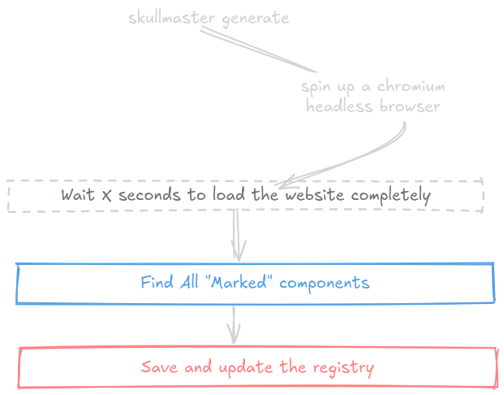
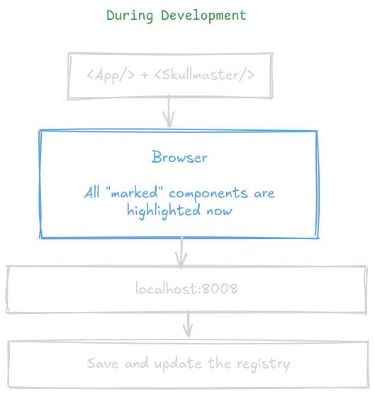
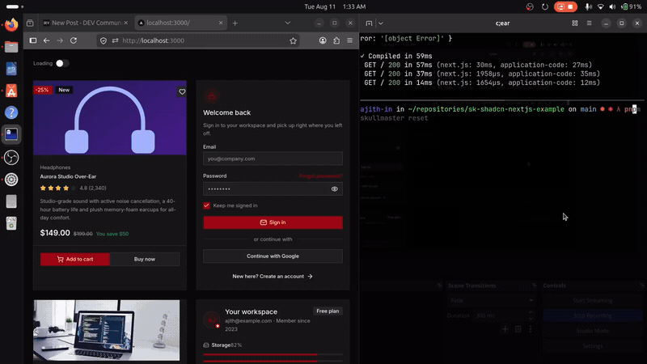

## Lot of skeletons

_An example UI skeleton_

<!-- end_slide -->
# Three Ways to Generate Skeletons
---

We’ll explore three approaches to generating skeletons from the source:

<!-- pause -->

## **01 · Build time + real browser**  
Render the actual application and extract the layout.

---

<!-- pause -->

## **02 · Build time + headless browser**  
Use the same rendering approach, but run it without a visible browser.

---
<!-- pause -->

## **03 · Build time + lightweight rendering pipeline**  
Extract the layout information needed for skeleton generation without relying on a full browser runtime.

---
<!-- pause -->

**The goal:** move skeleton generation to build time while balancing **fidelity, build speed, and complexity**.
<!-- end_slide -->
## Building skeletons manually
---

<!-- column_layout: [3, 2] -->

<!-- column: 0 -->
```tsx {all|3,11|4|7-8|9}
function UserCard({ user }) {
  return (
    <article className="user-card">
      

      <div className="content">
        <h3>{user.name}</h3>
        <p>{user.headline}</p>
        <button onClick={connect}>Connect</button>
      </div>
    </article>
  );
}
```
<!-- column: 1 -->


<!-- reset_layout -->
<!-- end_slide -->
## The skeleton we write instead
---
>  A skeleton made of the real markup would be read out as
> content — a `p` announced as text, a `button` announced as a control you can
> tab to. We can't keep the same semantic elements here.

<!-- column_layout: [3, 2] -->

<!-- column: 0 -->
```tsx

import "./skeleton-styles.css"
function UserCardSkeleton() {
  return (
    <div className="user-card-skeleton">
      <div className="avatar-skeleton" />

      <div className="content-skeleton">
        <div className="name-skeleton" />
        <div className="headline-skeleton" />
        <div className="connect-skeleton" />
      </div>
    </div>
  );
}
```
<!-- column: 1 -->


<!-- reset_layout -->

<!-- end_slide -->
## Multi source of truth
---
Product ships one more action.

```diff
 function UserCard({ user }) {
   return (
     <article className="user-card">
       

       <div className="content">
         <h3>{user.name}</h3>
         <p>{user.headline}</p>
         <button onClick={connect}>Connect</button>
+        <button onClick={message}>Message</button>
       </div>
     </article>
   );
 }
```

<!-- end_slide -->
### And the skeleton has to follow it.
--- 

```diff
 function UserCardSkeleton() {
   return (
     <div className="user-card">
       <div className="avatar" />

       <div className="content">
         <div className="name" />
         <div className="headline" />
         <div className="connect" />
+        <div className="message" />
       </div>
     </div>
   );
 }
```
<!--end_slide -->
## objectives 
---

<!-- pause -->
### 1. The source should be the only thing you need to maintain

Skeletons should be generated from the source code rather than maintained separately.

<!-- jump_to_middle -->

<!-- end_slide -->
## objectives 
---

### 2. Generated skeletons should still be customizable

You should be able to adjust the generated result when it isn't exactly what you
want, without maintaining an entirely separate skeleton.

<!-- jump_to_middle -->

<!-- end_slide -->
## objectives 
---

### 3. The generated skeleton should represent the rendered UI

What matters is not just the source markup, but what the component actually looks
like when rendered.

<!-- pause -->
### 4. The generated result should actually be a skeleton

Meaningful content from the source should not leak into the generated skeleton.

<!-- end_slide -->

<!-- jump_to_middle -->
💀 Master
---
 <!-- end_slide -->

## What the developer writes
---

A marker, an import, and a switch. That's the whole change:

```tsx {all|4-7, 9}
import { markAsSkull, Skeleton } from "skullmaster/react";

function UserCardPage({ user, isLoading }) {
  if (isLoading) {
    return <Skeleton name="UserCard" />;
  }

  return (
    <article {...markAsSkull("UserCard")} className="user-card">
      

      <div className="content">
        <h3>{user.name}</h3>
        <p>{user.headline}</p>
        <button onClick={connect}>Connect</button>
      </div>
    </article>
  );
}
```


<!--end_slide -->
## Skullmaster
---
The following diagram briefly explain the basic architecture of skullmaster


<!-- end_slide -->
## Generating the skeleton
---

### <span style="color:#A1A1AA">Option 1: a headless browser</span>
Load the site in a headless browser, query the marked component with JS, save the
rendered HTML, update the registry file. `boneyard.js` works almost exactly like
this — we'll see at the end why we didn't take it.

<!-- end_slide -->
## Generating the skeleton
---

### <span style="color:#4ADE80">Option 2: a dev-only script ← we go this way</span>
Inject a development-only script. The developer opens the site, clicks the fully
rendered component, and we read the runtime information off that click.

<!-- end_slide -->
## Selecting the component
---


<!-- end_slide -->
## The server
---

```d2 +render
direction:down
Click: "User clicked on\ncomponent"
Server: "Skullmaster Dev Server\nlocalhost:8008"

Transform: "Transform HTML payload\n→ React component"
Skeleton: "skeletons/UserCardSkeleton.tsx\n\nNew React component"
Registry: "registry.tsx\n\nAdd newly saved component"


Click -> Server: "2. Send captured\nHTML payload"

Server -> Transform: "3. Process payload"
Transform -> Skeleton: "4. Save generated component"
Transform -> Registry: "5. Update registry.tsx"

```


<!-- end_slide -->
## The transformation
---

Two ways to turn the captured markup into a skeleton.

### <span style="color:#A1A1AA">Option 1: replace everything with `div`s</span>
Every element becomes a box, sized from `getBoundingClientRect()`:

```tsx
toSkeleton(root) {
  return replaceEveryChildWithABox(root, measuredFromTheBrowser);
}
```

A static picture of one screen size — render it wider and it is wrong. `boneyard.js`
runs in a headless browser, so it can check more sizes than we can.

<!-- pause -->
### <span style="color:#4ADE80">Option 2: keep the elements semantically the same</span>

```tsx

<h3 className="title" aria-hidden="true" />
<button className="connect" disabled />
```

For some use cases that is a deal breaker, and it is fair. So the result still
behaves like a skeleton: we inject the ARIA attributes and strip the meaningful
information out of the source.

<!-- end_slide -->
## Transformation 1: Strip meaningful text
---

Every text node becomes a placeholder with the same approximate visual footprint.

```tsx
<span className="empty-set__text" data-text-node="true" data-depth="1">
  ██████ █████
</span>
```

The original content is gone. Names, prices, labels, and other meaningful strings never
reach the generated skeleton.

<!-- end_slide -->
## Transformation 2: Strip images
---

Images are replaced with empty generated placeholder graphics
```tsx
   
```


<!-- end_slide -->
## Transformation 3: Strip interactivity
---

Interactive elements remain in the generated tree, but their behavior is removed and
the element is hidden from assistive technology.

```tsx
<a
  data-depth="2"
  className="interactive-link"
  data-skull-btlr="0"
  data-skull-btrr="0"
  data-skull-bbrr="0"
  data-skull-bblr="0"
  data-visual-significance="0.20"
  data-skeleton-interactive="true"
  aria-hidden="true"
  tabIndex={-1}
>
  ████ ████
</a>
```


<!-- end_slide -->
## Transformation 4: Strip form interaction
---

Inputs keep their geometry and type, but become inert skeleton elements.

```tsx
<input
  data-depth="3"
  className="interactive-input"
  type="text"
  data-skull-btlr="0"
  data-skull-btrr="0"
  data-skull-bbrr="0"
  data-skull-bblr="0"
  data-visual-significance="0.46"
  data-skeleton-interactive="true"
  aria-hidden="true"
  tabIndex={-1}
  autoComplete="off"
  data-1p-ignore="true"
  data-lpignore="true"
  data-bwignore="true"
  data-protonpass-ignore="true"
  form="none"
/>
```


<!-- end_slide -->
## Transformation 5: Mark the skeleton root
---

The generated root is explicitly identified as a loading state.

```tsx
<div
  data-depth="0"
  className="card interactive-card empty-set__skeleton"
  data-skullmaster="AnchorLinks"
  role="status"
  aria-live="polite"
  aria-busy="true"
>
  ...
</div>
```


<!-- end_slide -->
## Transformation 7: Remove insignificant elements
---

Layout-only elements that do not contribute meaningful visual structure can be removed.

```tsx
// Source
<div className="wrapper">
  <div className="layout-helper">
    <span>{user.name}</span>
  </div>
</div>

// Generated skeleton
<div data-depth="-1">
  <span data-text-node="true" data-depth="2">
    ██████ █████
  </span>
</div>
```

The generator keeps the visual structure that matters and drops elements that render to
nothing or contribute no meaningful visual information.

<!-- end_slide -->
## Automatic generation
---




<!-- end_slide -->
<!-- jump_to_middle -->
Stage 5: <span style="color:blue">Customization<span>
---

<!-- end_slide -->
## Customizability
---

Of course we could go and edit the generated files. But that breaks the single source
of truth — and the fix dies the next time we generate. So the correction goes into the
source, where it changes no styles in production: only the way the skeleton is generated.

<!-- pause -->
### <span style="color:#4ADE80">Data attributes to the rescue</span>

They ride along in the DOM for free, and the generator is the only thing that reads them.

<!-- pause -->
### `data-depth="-1"` — transparent, but still laid out

Set it on elements that should stay invisible while keeping their place in the layout.
Remove it, or set another depth, on elements that should render a visible bone.

<!-- pause -->
### `data-skip-skull` — leave the whole subtree out

Add it to the root of anything that should not be generated at all. SkullMaster ignores
that element and every one of its descendants.

```html
<div data-skip-skull>
  <!-- this subtree never reaches the skeleton -->
</div>
```

<!-- end_slide -->
## Customizability, type safe
---

The same corrections, without touching markup by hand. The attributes had to be typed
into the DOM; these are typed for you.

<!-- pause -->
### `markAsSkull(name, tweaks?)`

Registers the component for skeleton generation, and takes the tweaks for the top level
element:

```tsx {1}
<section {...markAsSkull("Hero", { isTransparent: true })}>...</section>
```

<!-- pause -->
### `tweakForSkull(tweaks?)`

The same tweaks, applied to a child of an element that is already registered:

```tsx {1}
<fieldset {...tweakForSkull({ hideSubTree: true })}>...</fieldset>
```

<!-- pause -->
Nothing here changes production styling — the tweaks only change what ends up in the
generated skeleton.
<!-- end_slide -->
# Comparisons
--- 

## Comparing the Approaches

<!-- column_layout: [3, 2] -->

<!-- column: 0 -->

|                       | Skullmaster | Boneyard JS | SHS |
|-----------------------|-------------|-------------|-----------|
| Runtime overhead      | 🟢 Yes      | 🟢 Yes      | 🟢 No     |
| Customizability       | 🟡 Limited  | 🟡 Limited  | 🟢 High   |
| Auto-sync             | 🔴 No       | 🟢 Yes      | 🟢 Yes    |
| Conditional components | ⚪ Same    | ⚪ Same     | ⚪ Same   |
| Mock fixtures         | 🟡 Required | 🟡 Required | 🟡 Requir |
| Real skeleton markup  | 🔴 No       | 🟢 Yes      | 🟢 Yes    |

---
<!-- pause -->
### Runtime overhead

Shimmer From Structure generates the skeleton at build time, so there is no runtime generation overhead.


<!-- pause -->
### Customizability

Shimmer From Structure supports customization through data attributes, giving developers control over individual elements.

<!-- pause -->
### Auto-sync

Boneyard JS and Shimmer From Structure can regenerate when UI code changes.
For Skullmaster, component hashing  alert the developer, but regeneration remains developer-triggered.


<!-- column: 1 -->


<!-- pause -->

### Conditional components

No meaningful difference.

Modals, authenticated content, and other conditional UI require a headless browser and mock fixtures in all three approaches.

<!-- pause -->

### Mock fixtures

All three approaches require mock fixtures for conditional or otherwise inaccessible UI.

<!-- pause -->

### Real skeleton markup

Boneyard JS and Shimmer From Structure produce real skeleton markup.

Skullmaster does not.
<!-- end_slide -->
## Thanks!
---
<!-- column_layout: [1] -->
<!-- column: 0 -->
<!-- jump_to_middle -->
<!-- no_footer -->

# Thanks!

<span style="color:#a8df8e">https://github.com/ajth-in/skullmaster</span>
