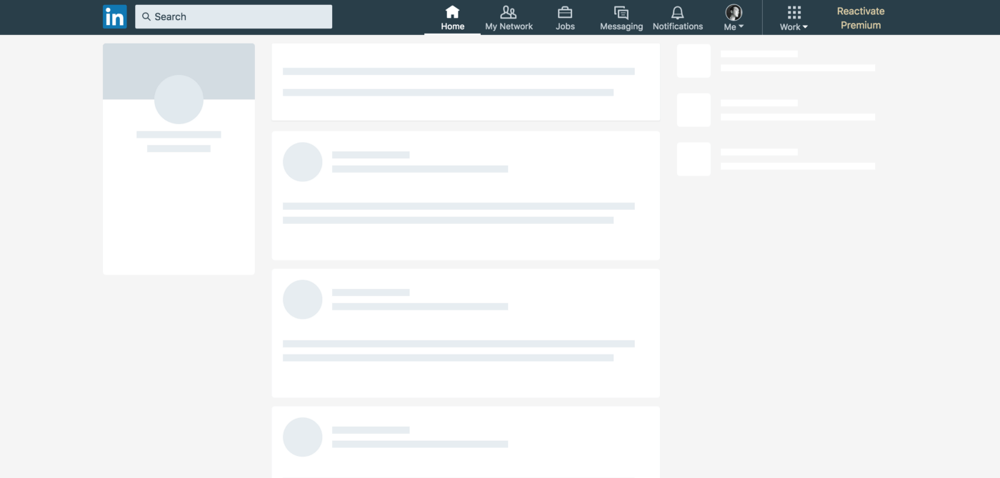

# Designing Faster Loading Screens
---

Waiting is inevitable. Being boring about it is optional.

Three ideas that make the wait feel shorter:

## ⦿ Controlling the perception of time

<!-- pause -->
<!-- alignment: center -->
| Loader style | Feels like |
| ------------ | ---------- |
| <span style="color:#A1A1AA">○ Blank screen</span> | <span style="color:#F87171">× Broken</span> |
| <span style="color:#A1A1AA">◌ Spinner</span>      | <span style="color:#FBBF24">~ Waiting</span> |
| <span style="color:#A1A1AA">▧ Skeleton</span>     | <span style="color:#4ADE80">✓ Almost done</span> |

<!-- pause -->
<!-- alignment: left -->
## ⦿ Setting expectations with the UI

> A fake progress bar is a promise you will break. Users forgive waiting;
> they do not forgive being lied to.

<!-- pause -->


## ⦿ Progressive loading

> Do not block the first byte on the last byte.

<!-- end_slide -->
## We need skeletons!!
---
<!-- alignment: center -->

_Skeleton UI Example_
<!-- end_slide -->
<!-- jump_to_middle -->

Building one is annoying!!
---
<!-- end_slide -->


## Building the skeleton 
---
A perfectly normal user card, shipping to production.

```tsx {3|7-8|9}
function UserCard({ user }) {
  return (
    <article className="user-card">
      

      <div className="content">
        <h3>{user.name}</h3>
        <p>{user.headline}</p>
        <button onClick={connect}>Connect</button>
      </div>
    </article>
  );
}
```

<!-- pause -->
Real semantics: the `article` is a landmark, the `h3` a heading, the `p` a paragraph.

<!-- pause -->
The `button` it takes focus, it answers the keyboard, it gets announced as a control.

<!-- end_slide -->
## The skeleton we write instead
---
>  A skeleton made of the real markup would be read out as
> content — a `p` announced as text, a `button` announced as a control you can
> tab to. We can't keep the same semantic elements here.

```tsx {3,9}
function UserCardSkeleton() {
  return (
    <div className="user-card">
      <div className="avatar" />

      <div className="content">
        <div className="name" />
        <div className="headline" />
        <div className="connect" />
      </div>
    </div>
  );
}
```


<!-- end_slide -->
## Multi source of truth
---
Product ships one more action.

```diff
 function UserCard({ user }) {
   return (
     <article className="user-card">
       

       <div className="content">
         <h3>{user.name}</h3>
         <p>{user.headline}</p>
         <button onClick={connect}>Connect</button>
+        <button onClick={message}>Message</button>
       </div>
     </article>
   );
 }
```

<!-- end_slide -->
### And the skeleton has to follow it.
--- 

```diff
 function UserCardSkeleton() {
   return (
     <div className="user-card">
       <div className="avatar" />

       <div className="content">
         <div className="name" />
         <div className="headline" />
         <div className="connect" />
+        <div className="message" />
       </div>
     </div>
   );
 }
```

Two files, one line, and nothing that forces them to move together.

<!-- end_slide -->

<!-- jump_to_middle -->

<!-- alignment: center -->
Generating skeletons from source!!
--

<!-- end_slide -->
## Design Principles
---

<!-- pause -->
### The source should be the only thing you need to maintain

Skeletons should be generated from the source code rather than maintained separately.

<!-- pause -->
### Generated skeletons should still be customizable

You should be able to adjust the generated result when it isn't exactly what you
want, without maintaining an entirely separate skeleton.

<!-- pause -->
### The generated skeleton should represent the rendered UI

What matters is not just the source markup, but what the component actually looks
like when rendered.

<!-- pause -->
### The generated result should actually be a skeleton

Meaningful content from the source should not leak into the generated skeleton.

<!-- end_slide -->
## Can we generate this from source alone?
---
```tsx {4-12|3,13}
function UserCardPage({ user }) {
  return (
    <Skeleton loading={user.isLoading}>
      <article className="user-card">
        

        <div className="content">
          <h3>{user.name}</h3>
          <p>{user.headline}</p>
          <button onClick={connect}>Connect</button>
        </div>
      </article>
    </Skeleton>
  );
}
```

<!-- pause -->
The card stays the card. We don't describe a skeleton, we wrap the real thing.

<!-- pause -->
Two lines of wrapper, and the loader comes out of the source we already maintain.

<!-- end_slide -->
## Option 1: The skeleton
---
The skeleton has to represent the rendered UI, so nothing semantic survives. So we
walk the source, and swap every element we can't keep.

```tsx {1,3}
function Skeleton({ loading, children }) {
  if (!loading) return children;
  return toSkeleton(children);
}
```

<!-- pause -->
> This is a **runtime** walk, and that's the problem. If you are going this way,
> you should have done it at build time — as a bundler plugin, or the correct
> one for your framework — not on every render, in every browser.

But the real question is: can we get the skeleton from the source alone?

<!-- end_slide -->
## No You Cant!!
---

### The `img` becomes a `div`... at what size?

<!-- pause -->
A replaced element has intrinsic dimensions. A `div` doesn't — it collapses to
nothing until something gives it a size. Only the browser knows the real size,
and only *after* layout, which is the one thing we don't have while loading.

<!-- pause -->
### The `button` becomes a `div`... wearing whose CSS?

<!-- pause -->
`button { }` stops matching. So do `:hover`, `:focus`, `:active`, `::before`.
Inherited styles change too: a `div` takes the parent's `font` and `line-height`,
so the placeholder is a different size than the real control — a layout shift, at
the exact moment the user can least tolerate one.

<!-- pause -->
### And everything else the rendered tree gives away

`.card > button` · `:nth-child` · `[type=…]` · `[data-…]` · `:has()` · `::before`
· `svg`, `canvas`, `video` · `useEffect` state · portals · lazy components ·
media queries · CSS-in-JS that only exists at runtime

<!-- pause -->
> We cant generate the skeltons from the source alone!! 

<!-- end_slide -->
## Option 2: Little help from browser
---
We need a browser for the runtime information. So use one — once, at build time:

```d2 +render +width:100%
direction: down
app: |md
  **1 · App in a browser**
  the real `UserCard`, marked as a skeleton
|
info: |md
  **2 · Runtime information**
  boxes, `getComputedStyle`, the DOM tree
|
gen: |md
  **3 · `toSkeleton(runtimeInfo)`**
  elements and text become measured `div`s
|
file: |md
  **4 · React component** → **5 · `UserCardSkeleton.tsx`**
  written to the file system, ready to import
|
app -> info
info -> gen
gen -> file
```

<!-- pause -->
The developer imports `UserCardSkeleton` and swaps it in while loading.

<!-- end_slide -->
## What the developer writes
---

A marker, an import, and a switch. That's the whole change:

```tsx {1-2,5-7,10}
import { markAsSkull } from "skullmaster";
import { UserCardSkeleton } from "~/__generated";

function UserCardPage({ user, isLoading }) {
  if (isLoading) {
    return <UserCardSkeleton />;
  }

  return (
    <article {...markAsSkull("UserCard")} className="user-card">
      

      <div className="content">
        <h3>{user.name}</h3>
        <p>{user.headline}</p>
        <button onClick={connect}>Connect</button>
      </div>
    </article>
  );
}
```

<!-- pause -->
The skeleton is generated once, committed, and never touched by hand again.

<!-- end_slide -->
## First challenge: Chicken or egg
---

The first time you run this, the skeleton doesn't exist yet — so importing it by name
is an error. So we ship one generic component that resolves the name lazily:

```tsx {5,15}
import DefaultBone from "./skeletons/DefaultBone";
import { lazy } from "react";

const registry = {
  UserCard: lazy(() => import("./skeletons/UserCard")),
} as const;

type SkeletonProps = { name: keyof typeof registry | (string & {}) };

export default function Skeleton({ name }: SkeletonProps) {
  const Component = registry[name];

  if (!Component) return <DefaultBone />;

  return <Component />;
}
```

<!-- pause -->
The name is a string, not an import. Generate it later, register it later — and
until then every unknown name falls back to a generic bone instead of crashing.

<!-- end_slide -->
## The fix: one generic `Skeleton`
---

No generated file in sight. The component asks for a skeleton by name, and the
registry does the rest:

```tsx {1,5-6}
import { markAsSkull, Skeleton } from "skullmaster/react";

function UserCardPage({ user, isLoading }) {
  if (isLoading) {
    return <Skeleton name="UserCard" />;
  }

  return (
    <article {...markAsSkull("UserCard")} className="user-card">
      

      <div className="content">
        <h3>{user.name}</h3>
        <p>{user.headline}</p>
        <button onClick={connect}>Connect</button>
      </div>
    </article>
  );
}
```

<!-- pause -->
The same file works before and after the skeleton is generated. Nothing to rename,
nothing to un-import, nothing to remember in the review.

<!-- end_slide -->
## Generating the skeleton
---

The developer's side is done. Now we have to produce `skeletons/UserCard` and add
it to the registry.

### <span style="color:#A1A1AA">Option 1: a headless browser</span>
Load the site in a headless browser, query the marked component with JS, save the
rendered HTML, update the registry file. `boneyard.js` works almost exactly like
this — we'll see at the end why we didn't take it.

<!-- pause -->
### <span style="color:#4ADE80">Option 2: a dev-only script ← we go this way</span>
Inject a development-only script. The developer opens the site, clicks the fully
rendered component, and we read the runtime information off that click.

<!-- pause -->
### Add the provider
In the entry file — `App.tsx`, `main.tsx` or `layout.tsx`:

```tsx {1,3}
import { Skullmaster } from "@skullmaster/react";

<Skullmaster />;
```

<!-- end_slide -->
## Selecting the component
---


<!-- pause -->
The added `Skullmaster` component highlights the marked component, and a single
click copies the rendered result — as in the video.

<!-- end_slide -->
## The raw HTML
---

The provider hands back the rendered markup of the marked component — the class
names we wrote, and nothing else:

```html
<article data-skullmaster="UserCard" class="user-card">
  
  <div class="content">
    <h3>Ada Lovelace</h3>
    <p>Mathematician</p>
    <button>Connect</button>
  </div>
</article>
```

<!-- pause -->
`1` — **transform it**:  Make this a skeleton

`2` — **save it**: `skeletons/UserCardSkeleton.tsx`, and one more registry entry.

<!-- end_slide -->
## The server
---

We run one command, next to the project:

```bash
skullmaster serve
# listening on http://localhost:8008
```

<!-- pause -->
`1` — the browser posts the captured payload to `localhost:8008`.

`2` — the server reads the client project, so it knows the stack it has to write.

`3` — the HTML is turned back into a React component, saved as
`skeletons/UserCardSkeleton.tsx`.

`4` — the registry file gets one more `lazy` entry, and the skeleton is live.

<!-- end_slide -->
## How it works
---

```d2 +render +width:100%
direction: down
src: |md
  **1 · The developer**
  marks the component, adds the provider
|
click: |md
  **2 · A click in the browser**
  the provider highlights it and captures the HTML
|
send: |md
  **3 · `localhost:8008`**
  the payload is posted to `skullmaster serve`
|
done: |md
  **4 · `skeletons/UserCardSkeleton.tsx`**
  the HTML becomes a component, the registry gets it
|
src -> click -> send -> done
```

<!-- pause -->
One click from the developer. Everything after it is the tool.

<!-- end_slide -->
## The transformation
---

Two ways to turn the captured markup into a skeleton.

### <span style="color:#A1A1AA">Option 1: replace everything with `div`s</span>
Every element becomes a box, sized from `getBoundingClientRect()`:

```tsx
toSkeleton(root) {
  return replaceEveryChildWithABox(root, measuredFromTheBrowser);
}
```

A static picture of one screen size — render it wider and it is wrong. `boneyard.js`
runs in a headless browser, so it can check more sizes than we can.

<!-- pause -->
### <span style="color:#4ADE80">Option 2: keep the elements semantically the same</span>

```tsx

<h3 className="title" aria-hidden="true" />
<button className="connect" disabled />
```

For some use cases that is a deal breaker, and it is fair. So the result still
behaves like a skeleton: we inject the ARIA attributes and strip the meaningful
information out of the source.

<!-- end_slide -->
## Strip the content
---

Three of the seven things we take out, before the element can be called a skeleton:

<!-- pause -->
### Replacing text content with skeleton placeholders
Every text node becomes a placeholder of its own size. We don't want any leaks
happening — nothing from the real UI ends up in the skeleton, not a name, not a
price, not a stray tooltip string.

<!-- pause -->
### Force override the colors of elements based on the depth
Every color the browser computed is thrown away and replaced by one from a small
palette, picked by how deep the element sits. A card becomes one flat surface
instead of a stack of unrelated colors.

<!-- pause -->
### Removing image sources and replacing them with generated placeholders
The `src` goes, and in its place a generated bone. Its width and height come from
the natural width and height of the image — which the browser gives us along with
the runtime info, so the placeholder never shifts the layout.

<!-- end_slide -->
## Reshape what is left
---

The elements stay, so they have to be rebuilt into something that reads as a bone:

<!-- pause -->
### Suppressing the interactivity of elements
Every handler, link and state is dropped. On top of that we add aria labels, so
the details are completely hidden — there is nothing left to click, and nothing
left to read out.

<!-- pause -->
### Adding style overrides to visually transform elements into skeletons
The styles are where the element turns into a bone: backgrounds, borders, radii
and text are overridden per element and per depth, until the markup behind it is
invisible.

<!-- pause -->
### Removing or hiding visually insignificant elements
The `div` wrappers that exist only for layout are dropped, along with anything
that renders to nothing. Fewer elements, smaller component, same picture.

<!-- end_slide -->
## Make it behave like a skeleton
---

A skeleton is not only a picture. It has to behave like one:

<!-- pause -->
### Adding the appropriate accessibility attributes for a loading state
The result gets the attributes of a loading state, so a screen reader announces
that something is loading instead of reading the card it stands in for.

<!-- pause -->
> There is more to it than that.

<!-- end_slide -->
## Automatic generation
---


<!-- end_slide -->
## Thanks!
---
<!-- column_layout: [1] -->
<!-- column: 0 -->
<!-- jump_to_middle -->
<!-- no_footer -->

# Thanks!

<span style="color:#a8df8e">https://github.com/ajth-in/skullmaster</span>
